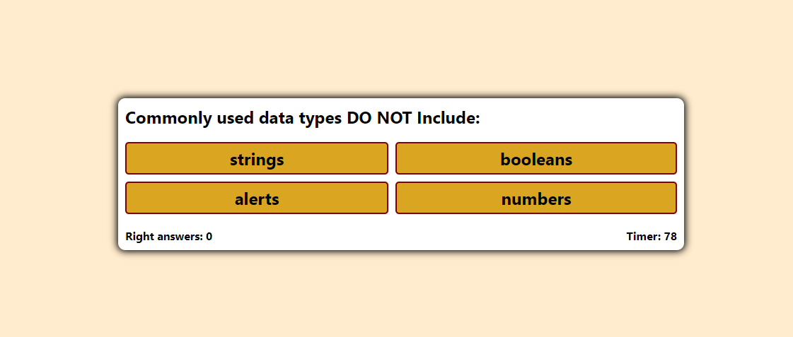
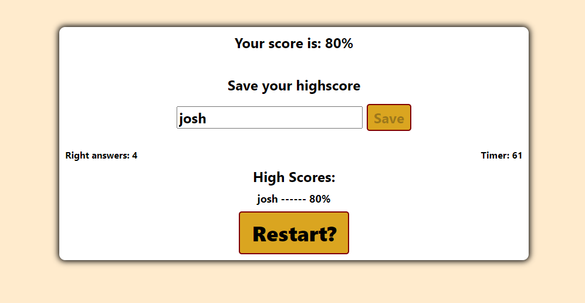

# Coding Quiz Challenge

## Description:
    This is a timed coding quiz with questions of a random order that tells you and lets you record your score at the end.

## HTML: 
    Question container with answer divs that get replaced with new questions and allows for user input at the end to record score

## CSS:
    formatted to allow user to better judge what answer is being highlighted and selected.

## JS:
    Starts quiz timer once the user presses start and keeps count of which questions the user got right to then display the score at the end. Also randomizes the order of the questions. Penalizes user with time deduction for wrong answers.

## Link: 
    https://jfig27.github.io/Coding-Quiz-Challenge/index.html

## Screenshots: 

